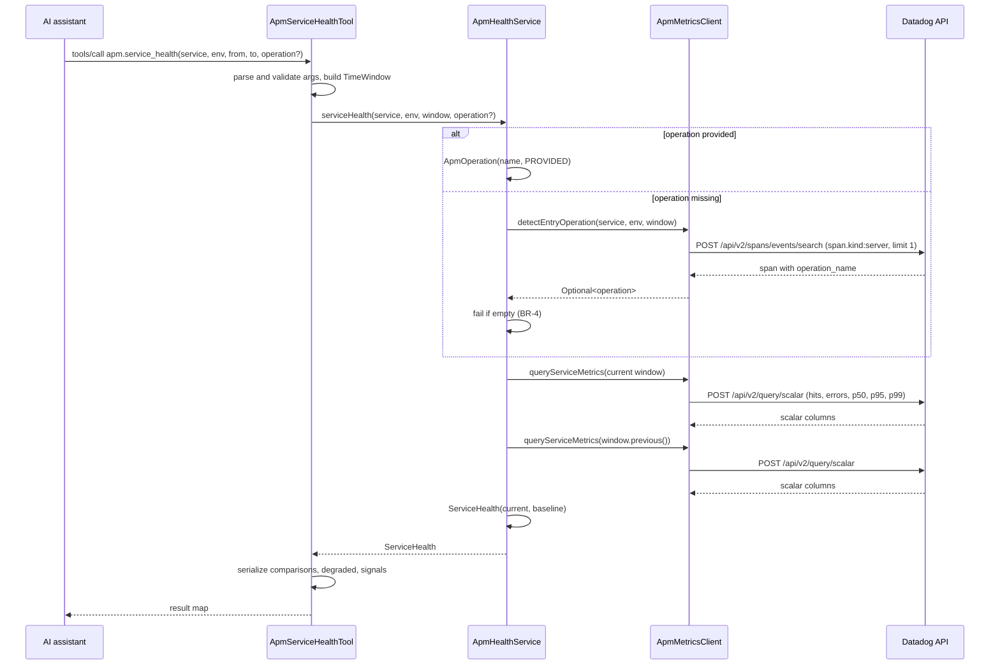
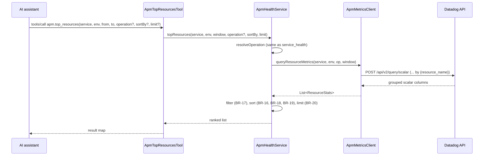

# Use Case: APM Service Health and Top Resources

Status: Design approved (2026-09-23). Not implemented yet.

## Context

The server can currently list error traces, inspect a single trace, search and summarize logs,
and correlate logs with a trace. All of these answer "what is this specific error?". None of them
answer the question that comes first during an incident: "which service or endpoint is degraded,
since when, and compared to what?".

This use case adds two MCP tools backed by Datadog APM **trace metrics**:

- `apm.service_health`: health of one service over a time window, compared with the previous window
  of the same length, with a degraded/not-degraded verdict.
- `apm.top_resources`: ranking of a service's resources (endpoints) by errors, error rate, latency,
  or traffic.

This is sub-project 1 of the APM extension. Later sub-projects, each with its own use case:
deploy/event correlation, triggered monitors, Error Tracking issues, and service dependencies.

Target stack: Java/Spring backends (`dd-java-agent`) and Next.js portals (`dd-trace-js`, server
side only). Browser-side Next.js telemetry is RUM, not APM, and is out of scope.

## Business Rules

### Data source

- BR-1: All numbers come from APM trace metrics (`trace.<operation>.*`) through the Metrics API v2
  scalar endpoint (`MetricsApi.queryScalarData`). Trace metrics are computed on 100% of ingested
  traffic, before sampling and retention filters, so counts and percentiles are exact. Indexed spans
  are never used for numbers.

### Operation name resolution

- BR-2: If the caller passes `operation`, it is used as is (`source = PROVIDED`).
- BR-3: Otherwise the operation is detected: fetch the most recent span matching
  `service:<service> env:<env> @span.kind:server @_top_level:1` (limit 1) and use its
  `operation_name` (`source = DETECTED`). `@_top_level:1` keeps only service entry spans; without it,
  inner server spans such as Spring's `spring.handler` can be picked instead of `servlet.request`. `service_health` detects over the current and baseline windows combined
  (`[from - (to - from), to)`), so an outage in the current window can still be reported.
  `top_resources` detects over the current window only.
- BR-4: If no span is found, the tool fails with:
  `No entry spans found for service <service> in env <env>; pass 'operation' explicitly`.
- Typical values: `servlet.request` (Java/Spring), `next.request` or `web.request` (Next.js).

### Windows

- BR-5: The current window is `[from, to)`. `from` must be before `to`.
- BR-6: The baseline window for `service_health` is the previous window of the same length:
  `[from - (to - from), from)`.

### Metrics

- BR-7: `hits` = `sum:trace.<op>.hits{service,env}.as_count()`.
- BR-8: `errors` = `sum:trace.<op>.errors{service,env}.as_count()`.
- BR-9: `errorRate` = `errors / hits * 100`. It is `0` when `hits = 0`.
- BR-10: Latency p50/p95/p99 comes from the `trace.<op>` distribution metric and is reported in
  milliseconds. If the distribution metric returns nothing, latency values are `null` and a note is
  added. The call does not fail.
- BR-11: `deltaPct` = `(current - baseline) / baseline * 100`. It is `null` when `baseline = 0` or
  when either value is `null`.

### Degraded verdict (`service_health`)

- BR-11a (minimum traffic): if `baselineHits < 100`, the rules below are not evaluated. The result
  is `degraded = false`, `signals` is empty, and `notes` contains
  `insufficient traffic in baseline window (<n> hits < 100)`. This avoids false positives on
  low-traffic services.

Otherwise, the service is `degraded` if **any** of these hold. Each rule that holds adds a human-readable entry
to `signals`. The thresholds are domain constants.

- BR-12 (error rate): `currentErrorRate >= 2 * baselineErrorRate` **and**
  `currentErrorRate - baselineErrorRate >= 1.0` (percentage points).
- BR-13 (latency): `baselineP95 > 0` and `currentP95 >= 1.5 * baselineP95`.
- BR-14 (traffic drop): `baselineHits > 0` and `currentHits <= 0.5 * baselineHits`.

### Ranking (`top_resources`)

- BR-15: One grouped query `by {resource_name}` over the current window only. No baseline.
- BR-16: `sortBy` is one of `errors` (default), `errorRate`, `latencyP95`, `hits`. Order is
  descending.
- BR-17: With `sortBy = errorRate`, resources with fewer than 20 hits are excluded.
- BR-18: Ties are broken by `hits`, descending.
- BR-19: A resource that has hits but no error row gets `errors = 0`. Resources with `null` latency
  go last when sorting by latency.
- BR-20: `limit` defaults to 10. The maximum is 50.

### Empty data

- BR-21: Empty metric responses are not errors. Values become `0` (counts) or `null` (latency) and
  an explanatory entry is added to `notes`.

## Domain Events

None. Both tools are read-only queries.

## Components

```
domain/
  ApmOperation          record(name, source: DETECTED | PROVIDED)
  TimeWindow            record(from, to); previous()
  ApmMetrics            record(hits, errors, p50, p95, p99); errorRate()
  MetricComparison      record(current, baseline); deltaPct()
  ServiceHealth         record(service, env, operation, window, current, baseline);
                        comparisons(), isDegraded(), signals()
  ResourceStats         record(resource, metrics)
  ResourceSortCriteria  enum ERRORS | ERROR_RATE | LATENCY_P95 | HITS; comparator(), min-hits filter
datadog/
  ApmMetricsClient      interface
                          Optional<String> detectEntryOperation(service, env, TimeWindow)
                          ApmMetrics queryServiceMetrics(service, env, operation, TimeWindow)
                          List<ResourceStats> queryResourceMetrics(service, env, operation, TimeWindow)
  ApmMetricsClientImpl  MetricsApi (v2) + SpansApi + RetryExecutor
application/
  ApmHealthService      resolveOperation(), serviceHealth(), topResources(); orchestration only
mcp/
  ApmServiceHealthTool  apm.service_health
  ApmTopResourcesTool   apm.top_resources
```

`DatadogClient` is not modified.

## Sequence Diagrams

### apm.service_health



### apm.top_resources



## API Contracts

### apm.service_health

Input:

| param       | type     | required | default               | notes                                  |
|-------------|----------|----------|-----------------------|----------------------------------------|
| `service`   | string   | yes      |                       |                                        |
| `env`       | string   | no       | `DATADOG_ENV_DEFAULT` |                                        |
| `from`      | ISO-8601 | yes      |                       |                                        |
| `to`        | ISO-8601 | yes      |                       |                                        |
| `operation` | string   | no       | detected (BR-3)       | e.g. `servlet.request`, `next.request` |

Output:

```json
{
  "success": true,
  "service": "payments",
  "env": "prod",
  "operation": "servlet.request",
  "operationSource": "detected",
  "window":   {"from": "2026-09-23T13:00:00Z", "to": "2026-09-23T14:00:00Z"},
  "baseline": {"from": "2026-09-23T12:00:00Z", "to": "2026-09-23T13:00:00Z"},
  "metrics": {
    "hits":       {"current": 12000, "baseline": 11800, "deltaPct": 1.7},
    "errors":     {"current": 340,   "baseline": 20,    "deltaPct": 1600.0},
    "errorRate":  {"current": 2.83,  "baseline": 0.17,  "deltaPct": 1564.7},
    "latencyP50": {"current": 45.0,  "baseline": 42.0,  "deltaPct": 7.1},
    "latencyP95": {"current": 310.0, "baseline": 290.0, "deltaPct": 6.9},
    "latencyP99": {"current": 900.0, "baseline": 850.0, "deltaPct": 5.9}
  },
  "degraded": true,
  "signals": ["error rate 0.17% -> 2.83%"],
  "notes": []
}
```

### apm.top_resources

Input:

| param       | type     | required | default               | notes                                            |
|-------------|----------|----------|-----------------------|--------------------------------------------------|
| `service`   | string   | yes      |                       |                                                  |
| `env`       | string   | no       | `DATADOG_ENV_DEFAULT` |                                                  |
| `from`      | ISO-8601 | yes      |                       |                                                  |
| `to`        | ISO-8601 | yes      |                       |                                                  |
| `operation` | string   | no       | detected (BR-3)       |                                                  |
| `sortBy`    | enum     | no       | `errors`              | `errors` \| `errorRate` \| `latencyP95` \| `hits` |
| `limit`     | number   | no       | 10                    | max 50                                           |

Output:

```json
{
  "success": true,
  "service": "payments",
  "env": "prod",
  "operation": "servlet.request",
  "operationSource": "detected",
  "window": {"from": "...", "to": "..."},
  "sortBy": "errors",
  "count": 1,
  "resources": [
    {"resource": "POST /api/checkout", "hits": 4200, "errors": 310, "errorRate": 7.38,
     "latencyP50": 120.0, "latencyP95": 850.0, "latencyP99": 2100.0}
  ],
  "notes": []
}
```

### Errors

| condition                                       | result                                                   |
|-------------------------------------------------|----------------------------------------------------------|
| invalid timestamp, `from >= to`, unknown sortBy | `McpToolException`: `Invalid arguments: ...`             |
| operation not provided and not detectable       | `McpToolException`: BR-4 message                         |
| Datadog 429 / 5xx                               | retried by `RetryExecutor`, then `McpToolException`      |
| empty metric data                               | success, zeros or nulls, entry in `notes` (BR-21)        |

## Constraints

- Datadog API client SDK stays at 2.50.0. `v2.api.MetricsApi.queryScalarData` is available there.
- The API and application keys need permission to query metrics (`timeseries_query`) in addition to
  the current APM and logs read permissions.
- No new frameworks. Wiring is manual in `DatadogMcpServer.main()`.
- All API calls go through `RetryExecutor`.
- Cost: `service_health` makes up to 3 API calls (detection plus 2 scalar queries).
  `top_resources` makes up to 2.

## Testing

- Domain (main focus, no mocks): `TimeWindow.previous()`, `deltaPct` with a zero baseline,
  `errorRate` with zero hits, each degraded rule exactly at its threshold, the minimum-traffic
  guard at 99 and 100 baseline hits, ranking, tie-breaks,
  null-latency ordering, the minimum-hits filter.
- `ApmMetricsClientImpl`: mocked `MetricsApi` and `SpansApi` through a test constructor, like
  `DatadogClientImpl`. Covers mapping of scalar responses, grouped columns, and missing columns.
- `ApmHealthService`: fake `ApmMetricsClient`. A provided operation wins over detection, and a
  missing detection fails.
- Tools: argument parsing, schema, and response shape.

## Tradeoffs and Rejected Alternatives

- **Indexed spans (`SpansApi.aggregateSpans`) as the data source: rejected.** They only see spans kept
  by retention filters, so hits and error rates are underestimated or biased and percentiles are
  approximate. Trace metrics are exact.
- **Hybrid (metrics for health, spans for ranking): rejected.** It would give two sources of truth.
  Grouping trace metrics by `resource_name` is enough for ranking.
- **Fixed default operation (`servlet.request`) instead of detection: rejected.** The Next.js portals
  use different operation names. Detection costs one extra call and still allows an override.
- **Baseline of the same window 7 days earlier: deferred.** Better for seasonal traffic (matches,
  weekends) but misleading after traffic changes. The previous window is simpler and catches recent
  spikes. It can be added later as a `baseline` parameter.
- **Extending `DatadogClient`: rejected.** It would mix span/log search with metrics and force every
  `DatadogClient` fake to implement new methods. A separate `ApmMetricsClient` keeps both focused.
- **Logic in the tools (like `LogSearchTool`): rejected.** Comparison and threshold rules are business
  rules and belong in the domain.

## Open Questions

1. **Percentile query shape.** Confirm during implementation the exact scalar query and aggregator for
   percentiles on the `trace.<op>` distribution (for example `p95:trace.servlet.request{...}` with the
   `percentile` aggregator). If an account only has the legacy
   `trace.<op>.duration.by.service.95p` metrics, decide whether to add a fallback.
2. **Next.js operation detection.** With `dd-trace-js`, both `web.request` and `next.request` may
   exist. Confirm which span carries `span.kind:server` so detection always picks the same one.

## Resolved Decisions

- **Diagnostics workflow (2026-09-23):** `apm_service_health` and `apm_top_resources` are step 0 of the
  MCP diagnostics workflow in the global `~/.claude/CLAUDE.md`. The step is skipped when the tools are
  not available in the session.
